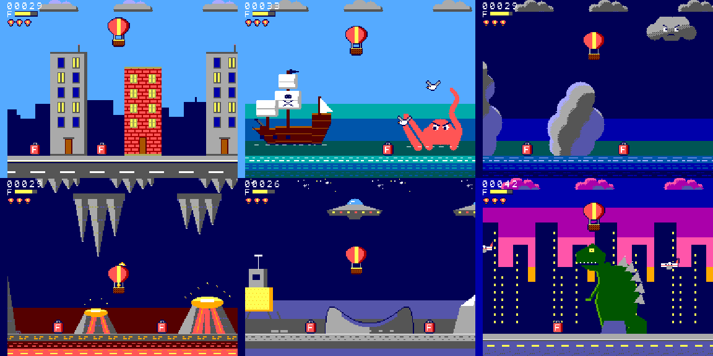
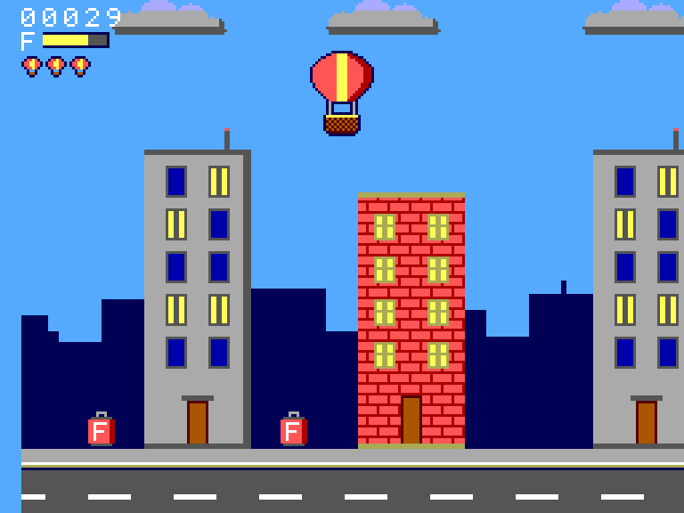
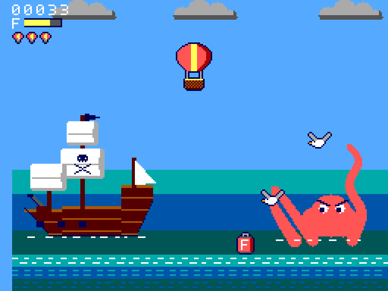
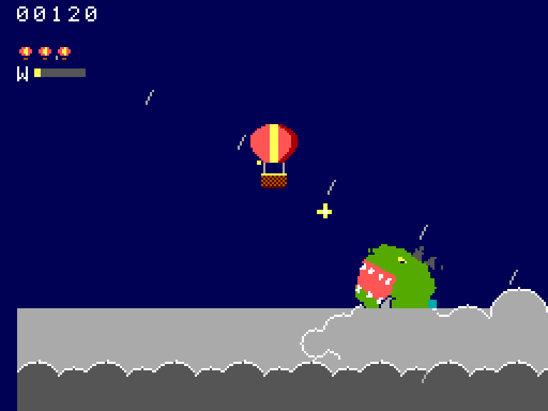
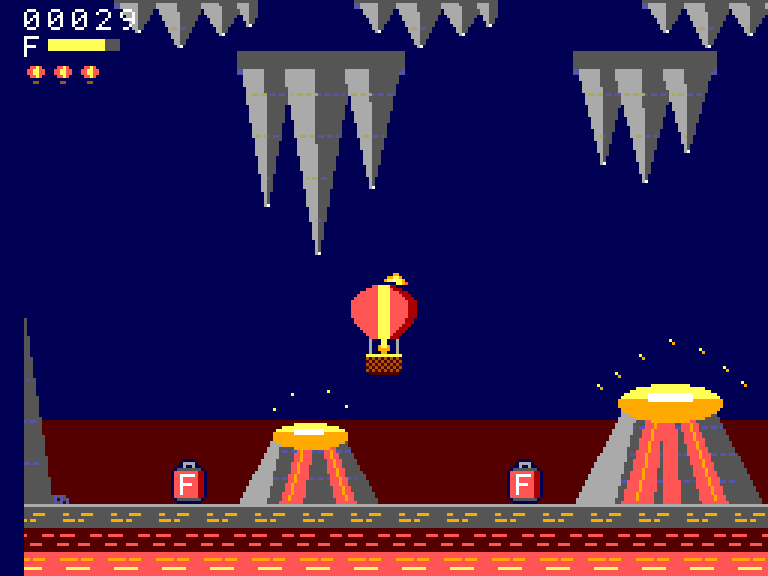
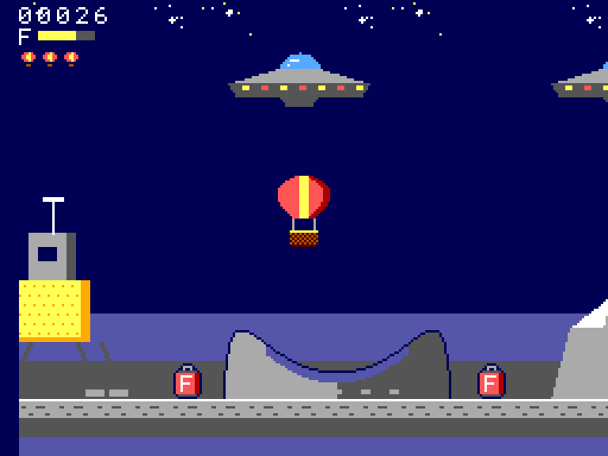
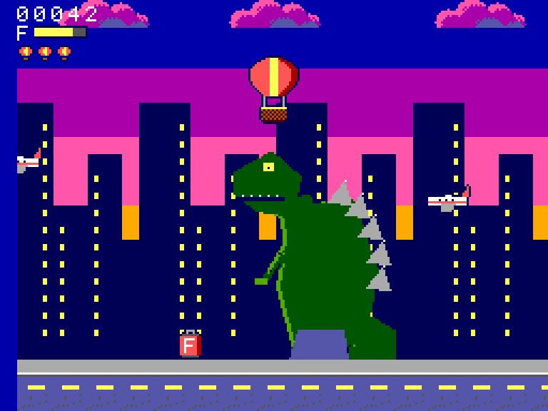
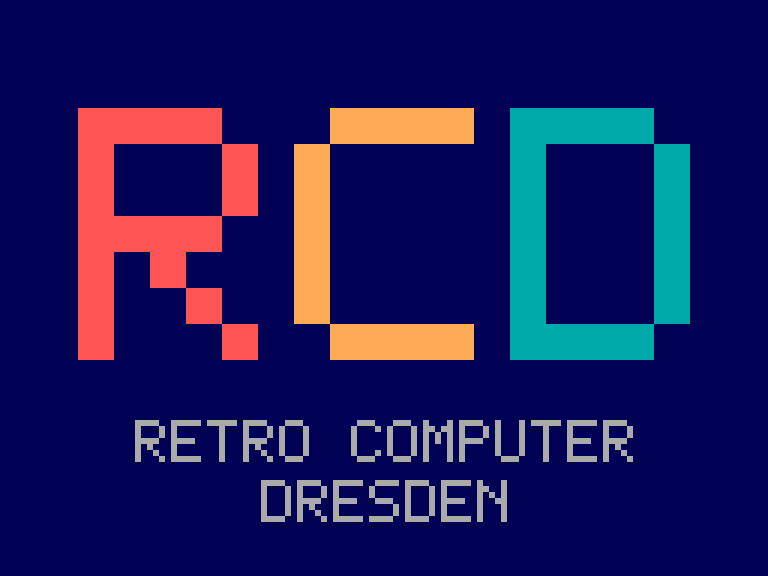
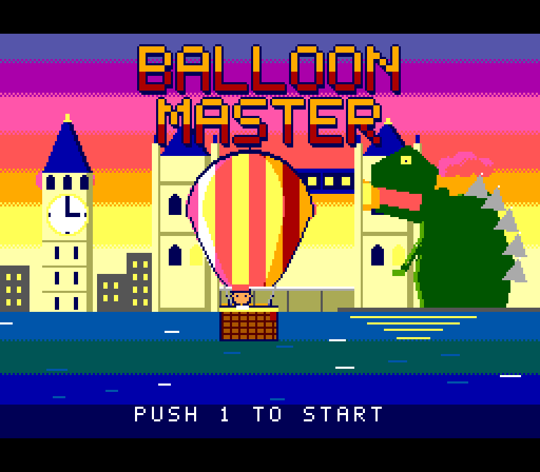
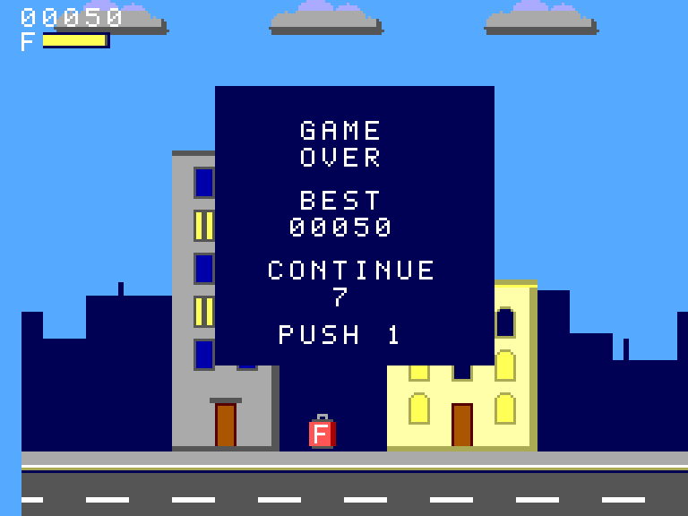

# Balloon Master

**A hot-air balloon adventure for the Sega Master System** — like Flappy Bird, only slower and calmer: the balloon drifts through a scrolling world and you only control the altitude. Six worlds, monsters, a fuel hook, checkpoints and a soundtrack played on the console's PSG chip.

▶ **[Play it in your browser](https://joergsf4.github.io/balloon-master/)** &nbsp;·&nbsp; 💾 **[Download the ROM](https://github.com/joergsf4/balloon-master/releases)** &nbsp;·&nbsp; [Deutsche Version](README.de.md)



## The game

Keep the balloon in the gap between the obstacles above and below. The burner lifts you, otherwise you sink. The burner burns fuel; fish fuel barrels from the pavement with the rope and hook. Six worlds, each with its own look, music and dangers:

| | |
|---|---|
|  | **London** — houses, towers, storm clouds with lightning; the finish is Tower Bridge. |
|  | **Pirate Cove** — tropical islands, pirate ships and a fort that shoot cannonballs along a ballistic arc (you see the smoke first), and a kraken that slaps at you with its tentacles. |
|  | **Thunderstorm** — a short, dark world full of angry clouds. Reach the rainbow. |
|  | **Cave** — stalagmites, stalactites, bats and erupting lava vents that throw volcanic bombs. Reach the exit. |
|  | **Moon** — low gravity, craters, a lander and UFOs with a zap beam and plasma shots. |
|  | **New York** (finale) — a dense skyline, blimps, UFOs and two giant monsters: a giant ape that throws boulders and a giant lizard that spits fire. Reach the Statue of Liberty. |

The monsters are not fought, they are big obstacles to fly around. Their shots fly in arcs and are announced by smoke or sparks, so you can always dodge them.

<p>
  
</p>

### Controls

| Sega Master System | Browser (default keys) | |
|---|---|---|
| Button 1 or Up | `X` or `↑` | Burner — the balloon rises. Also starts the game and continues. |
| Button 2 | `C` | Rope with hook — hold to lower it (max. 3 s out, then it is pulled in and locked for 1 s). |
| D-pad left/right | `←` `→` | Choose the start world on the title screen (Testing build only). |

### Rules in short

- Touching a building, cloud, monster, projectile or the ground is a crash.
- **Three lives** (little balloons below the fuel bar). After a crash you restart at the last **checkpoint** (at 1/3 and 2/3 of the level) with a full tank.
- All lives gone: **GAME OVER** with an arcade **continue countdown** from 9 — press Button 1 to continue (three lives, the level starts again), or let it run out to return to the title screen.
- A hooked barrel refuels you. Fuel left at the finish is a bonus.
- Wind (scroll speed) changes by itself every few seconds.
- The levels are fixed, not random, but a fairness check makes sure every gap can be flown through with the real physics.
- Leave the title screen alone for 10 s and an **attract mode** flies a level for you.

## Technical notes

- Z80, Sega Master System, 256 KB ROM (16 KB banks, Sega mapper), built with **SDCC** and **devkitSMS** in Docker.
- Parallax from line interrupts: far clouds (1/4 speed), obstacle band (game speed), ground (1.5×).
- Worlds are streamed column by column; each world lives in its own ROM bank with its own tile set (max. 448 tiles for background *and* sprites).
- All graphics are generated from ASCII art/Python in `tools/art/` into tiles and tile maps, with a fixed colour scheme and automatic tile de-duplication.
- Own PSG engine (`src/sound.c`): melody, bass and sound effects; the music is generated by `tools/music.py`.
- More hardware lessons (VDP timing, SDCC pitfalls, ...): [SMS_DEV_NOTES.md](SMS_DEV_NOTES.md). Design document (German): [KONZEPT.md](KONZEPT.md).

## Build and run

You need Docker (and, to run the ROM, any Master System emulator, e.g. Mednafen, or a MiSTer/Analogue Pocket/flash cart).

```sh
./build.sh                      # -> out/rom.sms (256 KB)
NO_LEVEL_SELECT=1 ./build.sh    # the player version without the start-world selection
./run.sh                        # runs out/rom.sms in Mednafen
tools/release.sh                # builds "Balloon Master Beta" (player) and "Balloon Master Testing" (with world select)
tools/make_web.sh               # assembles the browser version in site/
```

Test builds and helpers (see the scripts for details): `LEVEL_COLS=150`, `START_WORLD=3`, `AUTOPLAY=1`, `GODMODE=1`, `tools/worldtest.sh`, `tools/shot.sh`, `tools/screenshots.sh`, `tools/monstertest.sh`.

### Project layout

| Path | Content |
|---|---|
| `src/main.c` | the game: scrolling, column generation, controls, collision, lives, worlds |
| `src/world.h` | description of a world (obstacles, background, ground, goal, physics, monsters) |
| `src/sound.c` | PSG sound engine, music tracks and effects |
| `tools/art/*.py` | the pixel art: palette, shared sprites, one module per world (`SPEC`), title picture |
| `tools/gen_assets.py` | generates the tiles/maps (`res/generated/assets.h`, `src/bank3.c` ... `bank8.c`) |
| `tools/music.py`, `tools/make_logo.py`, `tools/make_title.py` | soundtrack, intro logo, title picture |
| `web/`, `tools/make_web.sh`, `.github/workflows/pages.yml` | the browser version (EmulatorJS, SMS Plus), published on GitHub Pages |

## License and credits

- Code, graphics and music are original works under the **MIT license** (see [LICENSE](LICENSE)). The music consists of original pieces in the style of each world plus public-domain tunes (London Bridge, a sea-shanty arrangement, Bach's Toccata motif, *The Star-Spangled Banner* by J. S. Smith).
- Built with SDCC and [devkitSMS](https://github.com/sverx/devkitSMS) (SMSlib, PSGlib: public domain; `crt0_sms.s`: GPL-2 with linking exception).
- The browser version uses [EmulatorJS](https://github.com/EmulatorJS/EmulatorJS) (GPL-3.0) with the SMS Plus core; see `web/LICENSES.txt`.
- The intro logo shows the letters of **Retro Computer Dresden e.V.** ([retrocomputer-dresden.de](https://retrocomputer-dresden.de)), taken from the club's earlier Master System demo.
- A fan project in the spirit of classic monster movies; not affiliated with any rights holder.
